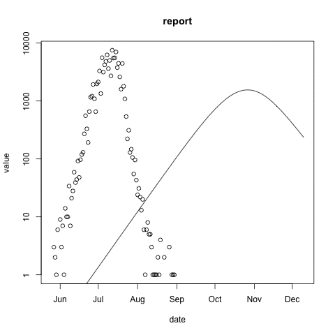

```{r setup, include=FALSE}
knitr::opts_chunk$set(echo = FALSE, eval = TRUE)
```

```{r, message=FALSE}
library(ggplot2)
library(McMasterPandemic)
library(dplyr)
library(tidyr)
library(lubridate)
library(equatiomatic)
options(MP_default_do_hazard = TRUE)
options(MP_default_do_make_state = FALSE)
options(MP_force_full_outflow = TRUE)
```

<style>
div.footnotes {
  position: absolute;
  bottom: 0;
  margin-bottom: 30px;
  margin-left: 70px;
  width: 80%;
  font-size: 0.6em;
}
</style>

<script src="https://ajax.googleapis.com/ajax/libs/jquery/3.1.1/jquery.min.js"></script>
<script>
$(document).ready(function() {
  $('slide:not(.backdrop):not(.title-slide)').append('<div class=\"footnotes\">');

  $('footnote').each(function(index) {
    var text  = $(this).html();
    var fnNum = (index+1).toString();
    $(this).html(fnNum.sup());

    var footnote   = fnNum + '. ' + text + '<br/>';
    var oldContent = $(this).parents('slide').children('div.footnotes').html();
    var newContent = oldContent + footnote;
    $(this).parents('slide').children('div.footnotes').html(newContent);
  });
});
</script>
<style>
.forceBreak { -webkit-column-break-after: always; break-after: column; }
</style>

## Acknowledgements -- Funding


{width=90%}

## Acknowledgements -- People

- Ben Bolker -- McMasterPandemic Creator/Architect
- Mac-Theobio COVID Modelling Group <footnote>Covid Modelling Blog: https://mac-theobio.github.io/covid-19/</footnote> 
   - Irena Papst, Mike Li (Public Health Agency of Canada, McMaster)
   - Ben Bolker, Jonathan Dushoff, David Earn (McMaster)
- Weiguang Guan -- C++ Developer (Sharcnet)
- Help Understanding Models / Alpha Testing / Test Cases
    - Zach Levine (Weizmann Institute of Science)
    - Lisa Kanary (Yukon University)
    - Caroline Colijn (Simon Fraser University)

# Background

## What does Refactoring mean? {.columns-2}

>- What?
>   - Change the internals of an existing code base
>   - Match behaviour of original code
>- Why?
>   - Maintainability
>   - Readability
>   - Speed
>   - Extensibility

<p class="forceBreak"></p>

>- Related concepts
>   - Non-functional requirements
>   - Technical debt

{width=90%}

## What is McMasterPandemic? {.columns-2}

* R package<footnote>[https://github.com/mac-theobio/McMasterPandemic](https://github.com/mac-theobio/McMasterPandemic)</footnote>
* Infectious disease forecasts
* Developed at McMaster University
* Covid-19 response

{style="margin-left: 35px; opacity: 0.9;" width=100%}

<p class="forceBreak"></p>

>- Forecasts
>    - Ontario Science Advisory Table
>    - Public Health Agency of Canada
>    - Chief Public Health Officer 
>    - World Health Organization (2020, Afro-Region, 49 countries)
>- Small user base
>    - Number of forecasters $\approx 3$

## Prediction of the Third Wave

Mac-Theobio COVID Modelling Group <footnote>Covid Modelling Blog: https://mac-theobio.github.io/covid-19/</footnote>

{width=65%}

## Prediction of the Third Wave

Mac-Theobio COVID Modelling Group <footnote>Covid Modelling Blog: https://mac-theobio.github.io/covid-19/</footnote>

{width=65%}

# Why Refactor McMasterPandemic?

## Why Refactor? -- slow forecasting {.columns-2}

>- Confidence bands slow to compute
>- Based on repeated simulation
>- Most time-consuming step for PHAC
>- Two approaches:
>   - Translate to C++ (done)
>   - Parallelize (todo)

<p class="forceBreak"></p>

{width=90%}

## Why Refactor? -- slow calbration {.columns-2}

>- Calibration: tuning parameters to data
>- Example
>   - observed case reports -- dots
>   - simulated case reports -- line
>   - optimize transmission rate using maximum likelihood
>   - negative binomial error model

<p class="forceBreak"></p>



## Why Refactor? -- slow calbration {.columns-2}

- Calibration: tuning parameters to data
- Based on trajectory matching
   - select parameter set
   - simulate data
   - compare simulated and observed data
   - update parameter set
   - repeat
- Again -- repeated simulations are slow

<p class="forceBreak"></p>


## Why Refactor? -- slow scenario exploration {.columns-2}

>- Public health modeller has to make weekly forecasts
>- Model fitting/calibration takes two days
>- Only three days to 
>   - explore scenarios
>   - write the report
>- No time to refine the model
>- No time to refine messaging

<p class="forceBreak"></p>

{width=100%}

## Why Refactor? -- slow scenario exploration {.columns-2}

- Public health modeller has to make weekly forecasts
- Model fitting/calibration takes two days
- Only three days to 
   - explore scenarios
   - write the report
- No time to refine the model
- No time to refine messaging
    
<p class="forceBreak"></p>

{width=100%}

**What if two days becomes two hours?**

**More time modelling and communicating, less time waiting for results**

## Why Refactor? -- slow model development

**Need a bit more background before answering ...**

## What is a Compartmental Model?

{width=80%}

## Base McMasterPandemic Model

{width=70%}

<footnote>Figure from Irena Papst</footnote>

## Model with Vaccination and Variants

{width=70%}
<footnote>Figure from Irena Papst</footnote>

## Matrices and Linear Algebra

**As models get more complex, quantities that looked like this ...**

 {width=35%}

## Matrices and Linear Algebra

**... become more complex**<footnote>This is actually a simplification</footnote>

{width=70%}{width=50%}

## Why Refactor? -- slow model development {.columns-2}

>- New variant emerges, as immunity from vaccination wanes
>- Public health modeller has to create new model structure
>- Requires a few weeks of software development
>- Public health situation changes over this time
>- Model is less relevant when complete

<p class="forceBreak"></p>

{width=90%}
<footnote>Figure from Irena Papst</footnote>

## Why Refactor? -- slow model development {.columns-2}

- New variant emerges
- Immunity from vaccination wanes
- Public health modeller has to create new model structure
- Requires a few weeks of software development
- Public health situation changes over this time
- Model is less relevant when complete

<p class="forceBreak"></p>

{width=90%}
<footnote>Figure from Irena Papst</footnote>

**What if a few weeks becomes an afternoon?**

**Forecasts are delivered quickly, resulting in bigger public health impact**

# Architecture

## Architecture {.columns-2}

{width=80%}

<p class="forceBreak"></p>

>- Call stack diagram
>   - Arrows from (layer of) functions that call other functions
>   - Arrows to (layer of) functions being called by other functions
>- Two use cases
>   - Calibration
>   - Forecasting
>- Both interfaces utilize same simulation engine

## Refactored Architecture {.columns-2}

{width=80%}

<p class="forceBreak"></p>

>- Refactored components in grey
>- Focus on two things
>    - model definition conveniences (focused human time)
>    - simulation speed (human waiting time)

# Increasing Simulation Speed

## Technology Choice -- TMB

>- Template Model Builder -- TMB
>- R package (convenient)
>- Objective functions in C++ (fast)
>- Uses automatic differentiation (fast)
>- Options for statistical approaches

## Aside -- Automatic Differentiation

>- Classical methods of computer-assisted differentiation
>   - Numerical differentiation by finite differencing
>   - Symbolic differentiation by computer algebra systems
>   - These are both slow with many inputs
>- Automatic differentiation
>   - Automatically applies the chain rule to standard mathematical functions
>   - Will not give general answers (like symbolic differentiation)
>   - Give very fast and accurate evaluations of derivatives at specific values

## Benchmark Example {.build}

```
TMB: Time difference of 7.8s
R: Time difference of 1741.0s
Speedup: 224x
```

**But to be conservative we were seeing 60x speedups regularly**

**Does this mean that a workflow that took an hour, will now take one minute?**

**Not necessarily**

## Managing Expectations -- Theory {.build}

**Split up code into two sets:**

1. Refactored code
2. Not refactored code

**Simple but important insight:**

If the code that is not refactored takes $x$ minutes to run, the fastest run time that could be achieved by refactoring is $x$ minutes

## Managing Expectations -- Theory {.build}

**Two type of code that are in the "Not refactored" set**

>- The code in MacPan that is being executed by the user's job, but is not refactored
>- The code that the user wrote (**don't forget about this!**)

## Managing Expectations -- Theory {.build}

**Run-times of two sets of code, in different states**

* $r_{\text{before}}$: refactored code, before refactoring
* $r_{\text{not_done}}$: unrefactored code
* $r_{\text{after}}$: refactored code, after refactoring

The total run-time before refactoring:
$$
t_{\text{before}} = r_{\text{before}} + r_{\text{not_done}}
$$

The total run-time after refactoring:
$$
t_{\text{after}} = r_{\text{after}} + r_{\text{not_done}}
$$

## Managing Expectations -- Theory {.build}

Dimensionless measures of this system:

* Realized speedup: $\tau = \frac{t_\text{before}}{t_\text{after}}$
* Naive speedup: $\alpha = \frac{r_\text{before}}{r_\text{after}}$
* Fraction refactored: $\rho = \frac{r_\text{before}}{t_{\text{before}}}$

Expression for the realized speedups<footnote>This is [Amdahl's Law](https://en.wikipedia.org/wiki/Amdahl%27s_law)</footnote>:
$$
\tau = \frac{1}{\frac{\rho}{\alpha} + 1 - \rho}
$$

## Managing Expectations -- Theory {.build}

* Conservative but typical realized speedups: $\tau \approx 6$
* Conservative but typical naive speedups: $\alpha \approx 60$

**Estimate fraction refactored, $\rho$, by rearranging Amdahl's Law**

$$
\rho = \frac{1 - \frac{1}{\tau}}{1 - \frac{1}{\alpha}} \approx 0.85
$$

## Performance Enhancements in Practice {.build}

>- Removing performance bottlenecks rarely results in speed ups
>- People try even more challenging computations
>- Measuring performance gains in units of 'times speed-up' misses the point
>- More of a binary thing:

**Has the performance optimization allowed people to do things that they couldn’t do before?**

## Testimonial

> I just wanted to send out this email to express how impressed/happy I am running the new TMB version.

> It is insanely fast and definitely saves me hours everyday and allows me to explore more scenarios.

> I can do many more things I couldn't before due to computation limitations.

> Thank you, you guys are heroes! 

# Increasing Model Flexibility

## Original McMasterPandemic Architecture {.columns-2}

{width=80%}

<p class="forceBreak"></p>


## Original McMasterPandemic Architecture {.columns-2}

{width=80%}

<p class="forceBreak"></p>

>- Create any compartment topology
>- Fairly general specification of rates of flow among compartments

## Example -- SIR {.build}

```{r echo=TRUE, eval=TRUE}
state = c(S = 20000, I = 100, R = 0)
params = c(gamma = 0.06, beta = 0.15, N = sum(state))
```
```{r echo=TRUE, eval=FALSE}
sir_model = (init_model(
    params, state,
    start_date = "2000-01-01",
    end_date = "2000-05-01",
  )
```
```{r echo=TRUE, eval=FALSE}
  %>% add_rate("S", "I", ~ (1/N) * (beta) * (I))
  %>% add_rate("I", "R", ~ (gamma))
)
```{r echo=FALSE, eval=TRUE}
# Inflexible in both directions
# Both more and less complexity was difficult to add in McMasterPandemic
sir_model = (init_model(
    params, state,
    start_date = "2000-01-01",
    end_date = "2000-05-01",
  )
  %>% add_rate("S", "I", ~ (1/N) * (beta) * (I))
  %>% add_rate("I", "R", ~ (gamma))
)
```

## Example -- SIR

```{r echo=TRUE, eval=FALSE}
(sir_model
 %>% simulate
 %>% filter(variable %in% names(state))
 %>% rename(compartment = variable, state = value)
 %>% mutate(compartment = factor(compartment, names(sir_model$state)))
 %>% ggplot
  +  geom_line(aes(x = Date, y = state, colour = compartment))
)
```

## Example -- SIR

```{r echo=FALSE, eval=TRUE}
(sir_model
 %>% simulate
 %>% filter(variable %in% names(state))
 %>% rename(compartment = variable, state = value)
 %>% mutate(compartment = factor(compartment, names(sir_model$state)))
 %>% ggplot
  +  geom_line(aes(x = Date, y = state, colour = compartment))
)
```


## Example -- SIR

```{r eval=FALSE, echo=TRUE}
(sir_model
 %>% simulate(format = 'wide')
 %>% rename(`Force of Infection` = S_to_I)
 %>% ggplot
  +  geom_line(aes(x = Date, y = `Force of Infection`))
)
```

## Example -- SIR

```{r eval=TRUE, echo=FALSE}
(sir_model
 %>% simulate(format = 'wide')
 %>% rename(`Force of Infection` = S_to_I)
 %>% ggplot
  +  geom_line(aes(x = Date, y = `Force of Infection`))
)
```

## Example -- Matrix-Valued Rates {.build}

**Create symbolic vectors and matrices**

```{r eval=FALSE, echo=TRUE}
C = vec('Ca', 'Cp', '(Cm) * (1 - iso_m)', '(Cs) * (1 - iso_s)')
```

**Use vectors and matrices to define rates**

```{r eval=FALSE, echo=TRUE}
%>% add_rate("S", "E", sum(I * C * beta * inverse_N))
```

**Keep things compact even when the model gets complex**

```{r eval=FALSE, echo=TRUE}
%>% vec_rate(
  "S" %_% vax_cat,
  "E" %_% vax_cat,
  kronecker(vax_trans_red, t(baseline_trans_rates)) %*% Istate
)
```

## Example -- Erlang SEIR Model


<footnote>[Image from Comsol Blog](https://www.comsol.com/blogs/modeling-the-spread-of-covid-19-with-comsol-multiphysics/)</footnote>, <footnote>[Model described in Champredon et al (2018)](https://epubs.siam.org/doi/pdf/10.1137/18M1186411)</footnote>

## Example -- Erlang SEIR Model {.build}

```{r eval=TRUE, echo=TRUE}
m = 5 # number of E boxes
(chained_E_boxes = "E" %_% 1:m)
```

```{r eval=FALSE, echo=TRUE}
# sojourn through exposed compartments
  %>% rep_rate(
    chained_E_boxes[1:(m-1)],
    chained_E_boxes[2:m],
    ~ (m) * (sigma)
  )
```

Full example online<footnote>https://canmod.net/misc/flex_intro#erlang-seir</footnote>

## Example -- BC Omicron Model{.columns-2}

{width=80%}<footnote>Thank you Caroline Colijn! (unpublished)</footnote>

{width=90%}<footnote>Graph with McMasterPandemic. Code: https://canmod.net/misc/flex_intro#bc-covid-omicron</footnote>

## Library of Examples

[https://canmod.net/misc/flex_intro](https://canmod.net/misc/flex_intro)

## Interface Lessons

>- Simple models are easy anyways
>- Need to focus on complex structured models as the primary use case
>- Focus on modelling, not data manipulation or visualization -- plug into standard tools

# In Progress

## Architecture{.columns-2}

{width=80%}

## In Progress{.columns-2}

{width=80%}

<p class="forceBreak"></p>

>- Refactor data fitting components in C++
>- Utilize automatic differentiation
>   - More speed
>   - Better optimization steps
>   - Converge in fewer iterations
>- Flexibility in statistical methodology
>   - Latent variables
>   - Process noise
>   - Splines

# Thank you!
