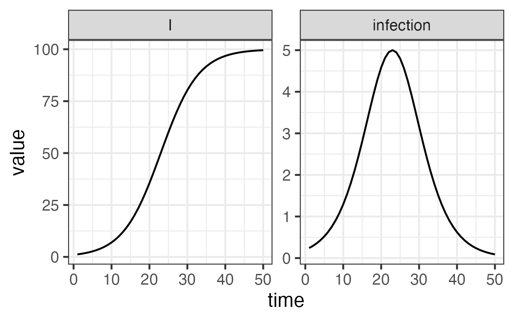

::: {.cell}

:::


## Acknowledgements

-   Canadian Institute for Health Information for the invitation
-   [CANMOD :cry:](https://canmod.net) and [PHAC](https://www.canada.ca/en/public-health) for funding 
-   Original developers were real modellers (Ben Bolker, Jonathan
    Dushoff, David Earn, Mike Li, Irena Papst)
-   C++ programming (Weiguang Guan, Sharcnet), model library (Jen Freeman), and product models (Darren Flynn-Primrose)
-   Amy Hurford, Lisa Kanary, Caroline Colijn, <span style="color:red;">Zahra Cook</span>, Claude Nadeau, Philippe Berthiaume, Evan Mitchell, Brian Gaas, Kevin Zhao, Maya Earn
-   Irena Papst and Mike Li

## Story

* Why Models?
* Background
* Motivation
* Software
* Model Library
* Calibration
* Illustrations
* Open-Source Tools

## Story

* Why Models? : <span style="color:red;">Why even bother at all with modelling?</span>
* Background
* Motivation
* Software
* Model Library
* Calibration
* Illustrations
* Open-Source Tools

## Story

* Why Models?
* Background : <span style="color:red;">McMasterPandemic software was developed for COVID-19 forecasting.</span>
* Motivation
* Software
* Model Library
* Calibration
* Illustrations
* Open-Source Tools

## Story

* Why Models?
* Background
* Motivation : <span style="color:red;">The urgency of producing regular forecasts during the pandemic impeded software development.</span>
* Software
* Model Library
* Calibration
* Illustrations
* Open-Source Tools

## Story

* Why Models?
* Background
* Motivation
* Software : <span style="color:red;">The `macpan2` project is a more versatile public health modelling tool being actively developed to address these challenges.</span>
* Model Library
* Calibration
* Illustrations
* Open-Source Tools

## Story

* Why Models?
* Background
* Motivation
* Software
* Model Library : <span style="color:red;">Instead of building models from the ground up, applied modellers can leverage `macpan2`’s library of predefined models as starting points.</span>
* Calibration
* Illustrations
* Open-Source Tools

## Story

* Why Models?
* Background
* Motivation
* Software
* Model Library
* Calibration : <span style="color:red;">`macpan2` employs formal mathematical optimization for the efficient calibration of model parameters to data.</span>
* Illustrations
* Open-Source Tools

## Story

* Why Models?
* Background
* Motivation
* Software
* Model Library
* Calibration
* Illustrations : <span style="color:red;">I'll dig into a few examples of work using `macpan2`.</span>
* Open-Source Tools

## Story

* Why Models?
* Background
* Motivation
* Software
* Model Library
* Calibration
* Illustrations
* Open-Source Tools : <span style="color:red;">The set of open-source tools available for epidemiologists to build forecasting models is improving and expanding.</span>

# Why Models?

Why even bother at all with modelling?

## What do you get out of mechanistic modelling?

(in applied, non-academic, data-informed, infectious disease, public health work)

::: incremental
* Amplifies utility of data
* Forecasting (accessing 'data' of the future)
* Understanding mechanism (what caused the data we see?)
* Counter-factuals (what-if scenarios)
:::

## Impact on the Public Health Agency of Canada (examples)

* Measles 2024: [https://www.canada.ca/content/dam/phac-aspc/documents/services/emergency-preparedness-response/rapid-risk-assessments-public-health-professionals/rapid-risk-assessment-measles-public-health-implications-2024/rapid-risk-assessment-measles-public-health-implications-2024.pdf](https://www.canada.ca/content/dam/phac-aspc/documents/services/emergency-preparedness-response/rapid-risk-assessments-public-health-professionals/rapid-risk-assessment-measles-public-health-implications-2024/rapid-risk-assessment-measles-public-health-implications-2024.pdf)
* MPox 2022: [https://onlinelibrary.wiley.com/doi/10.1002/jmv.29256](https://onlinelibrary.wiley.com/doi/10.1002/jmv.29256)
* COVID-19 2021: [https://www.canada.ca/content/dam/phac-aspc/documents/services/diseases-maladies/coronavirus-disease-covid-19/epidemiological-economic-research-data/update-covid-19-canada-epidemiology-modelling-20210326-en.pdf](https://www.canada.ca/content/dam/phac-aspc/documents/services/diseases-maladies/coronavirus-disease-covid-19/epidemiological-economic-research-data/update-covid-19-canada-epidemiology-modelling-20210326-en.pdf)


# Background

McMasterPandemic was developed for COVID-19 modelling and forecasting.


## PHAC report involving `McMasterPandemic`


## PHAC report involving `McMasterPandemic`


## Forecasting


::: {.cell}
::: {.cell-output-display}

:::
:::


::: aside
[mac-theobio.github.io/forecasts/outputs/ON_accuracy.html](https://mac-theobio.github.io/forecasts/outputs/ON_accuracy.html)
:::


## McMasterPandemic COVID-19 (Mechanistic) Model


::: aside
[mac-theobio.github.io/covid-19](https://mac-theobio.github.io/covid-19)
:::

## COVID-19 Vaccination (Mechanistic) Model

{.absolute left=0 width="700"}

::: aside
[mac-theobio.github.io/covid-19](https://mac-theobio.github.io/covid-19)
:::


# Motivation

The urgency of producing regular forecasts during the pandemic impeded software development.

## Model Development Cycle


## Lessons -- modeller needs and wants

Mechanistic modelling

Fast simulations and calibrations

Statistically principled

Functionality-rich

Modular model building

Easy to use

::: aside
[canmod.github.io/macpan-book/index.html#vision-and-direction](https://canmod.github.io/macpan-book/index.html#vision-and-direction)
:::

## Lessons -- modeller needs and wants

Mechanistic modelling : <span style="color:red;">Prediction is not enough. Must explain why.</span>

Fast simulations and calibrations

Statistically principled

Functionality-rich

Modular model building

Easy to use

::: aside
[canmod.github.io/macpan-book/index.html#vision-and-direction](https://canmod.github.io/macpan-book/index.html#vision-and-direction)
:::

## Lessons -- modeller needs and wants

Mechanistic modelling

Fast simulations and calibrations : <span style="color:red;">Computation cannot hold back thinking.</span>

Statistically principled

Functionality-rich

Modular model building

Easy to use

::: aside
[canmod.github.io/macpan-book/index.html#vision-and-direction](https://canmod.github.io/macpan-book/index.html#vision-and-direction)
:::

## Lessons -- modeller needs and wants

Mechanistic modelling

Fast simulations and calibrations

Statistically principled : <span style="color:red;">Uncertainty estimation (confidence intervals, priors) </span>

Functionality-rich

Modular model building

Easy to use

::: aside
[canmod.github.io/macpan-book/index.html#vision-and-direction](https://canmod.github.io/macpan-book/index.html#vision-and-direction)
:::

## Lessons -- modeller needs and wants

Mechanistic modelling

Fast simulations and calibrations

Statistically principled

Functionality-rich : <span style="color:red;">"But I need to use fancy modelling idea X."</span>

Modular model building

Easy to use

::: aside
[canmod.github.io/macpan-book/index.html#vision-and-direction](https://canmod.github.io/macpan-book/index.html#vision-and-direction)
:::

## Lessons -- modeller needs and wants

Mechanistic modelling

Fast simulations and calibrations

Statistically principled

Functionality-rich

Modular model building : <span style="color:red;">"Need to stratify my in-use MPox model by age."</span>

Easy to use

::: aside
[canmod.github.io/macpan-book/index.html#vision-and-direction](https://canmod.github.io/macpan-book/index.html#vision-and-direction)
:::

## Lessons -- modeller needs and wants

Mechanistic modelling

Fast simulations and calibrations

Statistically principled

Functionality-rich

Modular model building

Easy to use : <span style="color:red;">"Why would I switch from the tool I already know how to use?"</span>

::: aside
[canmod.github.io/macpan-book/index.html#vision-and-direction](https://canmod.github.io/macpan-book/index.html#vision-and-direction)
:::


## Lessons -- <span style="color:red;">focus here on these</span>

<span style="color:red;">Mechanistic modelling</span>

<span style="color:red;">Fast simulations and calibrations</span>

Statistically principled

Functionality-rich

Modular model building

<span style="color:red;">Easy to use</span>

::: aside
[canmod.github.io/macpan-book/index.html#vision-and-direction](https://canmod.github.io/macpan-book/index.html#vision-and-direction)
:::


# Software

To address these challenges, the `macpan2` project was launched to create a more versatile public health modelling tool, integrating lessons learned from the pandemic.

[https://canmod.github.io/macpan2](https://canmod.github.io/macpan2)


## Timeline

```         
+-----------+------+-------------------------------------------------------+
| nickname  | year | description                                           |
+-----------+------+-------------------------------------------------------+
| macpan1   | 2020 | original covid models in R engine                     |
| macpan1.5 | 2021 | fast C++ engine and flexibility for VOC modelling     |
| macpan2   | 2023 | general architecture to implement the lessons learned |
| macpan2   | 2024 | simple interface to general architecture              |
+-----------+------+-------------------------------------------------------+
```

::: aside
macpan1 = [github.com/mac-theobio/McMasterPandemic/releases/tag/v0.0.20.1](https://github.com/mac-theobio/McMasterPandemic/releases/tag/v0.0.20.1)

macpan1.5 = [github.com/mac-theobio/McMasterPandemic](https://github.com/mac-theobio/McMasterPandemic)

macpan2 = [github.com/canmod/macpan2](https://github.com/canmod/macpan2)
:::

## Lessons

<span style="color:red;">Mechanistic modelling</span>

Fast simulations and calibrations

Statistically principled

Functionality-rich

Modular model building

Easy to use

::: aside
[canmod.github.io/macpan-book/index.html#vision-and-direction](https://canmod.github.io/macpan-book/index.html#vision-and-direction)
:::

## Mechanistic Modelling

**Why Not Just Use AI for Everything?**


::: aside
[mac-theobio.github.io/covid-19](https://mac-theobio.github.io/covid-19)
:::

## Mechanistic Modelling

- Useful for exploring "what if" scenarios.
- Causal, epidemiological principles build confidence in predictions beyond just fitting data.

{.absolute left=0 width="700"}


## Mechanistic Modelling

* Limitations of AI
* Weather Forecasting as a Gold Standard
* Responsibility to Decision-Makers

## Mechanistic Modelling

* Limitations of AI : <span style="color:red;">AI predicts well but doesn’t generate hypotheses or uncover causal relationships like mechanistic models.</span>
* Weather Forecasting as a Gold Standard
* Responsibility to Decision-Makers

## Mechanistic Modelling

* Limitations of AI
* Weather Forecasting as a Gold Standard : <span style="color:red;">Mechanistic models drive accuracy and uncertainty quantification, unlikely surpassed by AI.</span>
* Responsibility to Decision-Makers

## Mechanistic Modelling

* Limitations of AI
* Weather Forecasting as a Gold Standard
* Responsibility to Decision-Makers : <span style="color:red;">Mechanistic models provide clear, explainable rationale.
  * AI often can't explain beyond data fitting
  * Maybe large language models are challenging this
  * Even ChatGPT should use mechanisms when explaining</span>

## Lessons

Mechanistic modelling

<span style="color:red;">Fast simulations and calibrations</span>

Statistically principled

Functionality-rich

Modular model building

Easy to use

::: aside
[canmod.github.io/macpan-book/index.html#vision-and-direction](https://canmod.github.io/macpan-book/index.html#vision-and-direction)
:::

## Computational Efficiency

Why is it important?  What goes into a picture like this?


::: {.cell}
::: {.cell-output-display}

:::
:::


## Calibration -- Trajectory Matching

::: columns
::: {.column width="40%"}

:::

::: {.column width="60%"}
> -   Toy simulated data example
> -   "Observed" case reports -- dots
> -   Model-predicted case reports -- line
> -   Optimize transmission rate using maximum likelihood
:::
:::


## Lessons

Mechanistic modelling

Fast simulations and calibrations

Statistically principled

Functionality-rich

Modular model building

<span style="color:red;">Easy to use</span>

::: aside
[canmod.github.io/macpan-book/index.html#vision-and-direction](https://canmod.github.io/macpan-book/index.html#vision-and-direction)
:::

## Interface


::: {.cell}

```{.r .cell-code}
spec = mp_tmb_model_spec(
    before = S ~ N - I
  , during = mp_per_capita_flow("S", "I", "beta * I / N", "infection")
  , default = list(N = 100, I = 1, beta = 0.2)
)
```
:::


::: incremental
* Will slowly walk through what code means
* Users interact by supplying `R` code
* Will talk later about similar tools in Python
* Goal: easy to read for modellers
:::

::: aside
[https://canmod.github.io/macpan2#hello-world](https://canmod.github.io/macpan2#hello-world)
:::

## Specifying Per-Capita Flows


::: {.cell}

```{.r .cell-code}
spec = mp_tmb_model_spec(
  ...
  mp_per_capita_flow("S", "I", "beta * I / N", "infection")
  ...
)
```
:::


::: aside
[https://canmod.github.io/macpan2#hello-world](https://canmod.github.io/macpan2#hello-world)
:::


## Specifying Per-Capita Flows


* `S` : number of susceptible individuals
* `I` : number of infectious individuals
* $\beta$ : transmission rate
* `N` : total population size

## Specifying Per-Capita Flows


::: {.cell}

```{.r .cell-code}
spec = mp_tmb_model_spec(
  ...
  mp_per_capita_flow("S", "I", "beta * I / N", "infection")
  ...
)
```
:::


::: aside
[https://canmod.github.io/macpan2#hello-world](https://canmod.github.io/macpan2#hello-world)
:::

## Drawing Flow Diagrams

Specifications allow us to draw flow diagrams.


::: {.cell}

:::

::: {.cell}

```{.r .cell-code}
(spec                    ## model specification
  |> mp_layout_paths()   ## find where to place boxes
  |> plot_flow_diagram() ## draw diagram
)
```
:::

::: {.cell}
::: {.cell-output-display}
{width=480}
:::
:::


## Drawing Flow Diagrams

::: {.incremental}
* Automatic layout often looks nice for more realistic models.
* Based on finding all paths through the system.
:::


::: {.cell}
::: {.cell-output-display}
{width=960}
:::
:::


## Drawing Flow Diagrams

* Automatic layout often looks nice for more realistic models.
* Based on finding all paths through the system.


::: {.cell}
::: {.cell-output-display}
{width=960}
:::
:::


## Flows to Differential Equations


::: {.cell}

```{.r .cell-code}
spec = mp_tmb_model_spec(
  ...
  mp_per_capita_flow("S", "I", "beta * I / N", "infection")
  ...
)
```
:::


$$
\begin{align}
\text{infection} & = S \times \beta I / N
\end{align}
$$


## Flows to Differential Equations


::: {.cell}

```{.r .cell-code}
spec = mp_tmb_model_spec(
  ...
  mp_per_capita_flow("S", "I", "beta * I / N", "infection")
  ...
)
```
:::


$$
\begin{align}
\text{infection} & = S \times \beta I / N \\
\frac{dS}{dt} & = -\text{infection} \\
\frac{dI}{dt} & = +\text{infection} \\
\end{align}
$$

::: aside
Sorry for the math. This is how our users think.
:::


## Simulation Syntax

::: {.incremental}
* You do not need to read this code
* Philosophy: Do not reinvent the wheel
* Simulation output standardized for all models
* Easily plugs into existing popular tools (e.g., `ggplot2`)
:::


::: {.cell}

:::

::: {.cell}

```{.r .cell-code}
(spec
 ## macpan2 part ----------------
 |> mp_simulator(time_steps = 50, outputs = c("I", "infection"))
 |> mp_trajectory()
 
 ## not macpan2 ----------------
 |> ggplot() 
 + geom_line(aes(time, value)) 
 + facet_wrap(~ matrix, scales = "free")
 + theme_bw()
)
```
:::


## Simulation Syntax

{width="800"}

## Specifying Models


::: {.cell}

```{.r .cell-code}
spec = mp_tmb_model_spec(
  ...
  , mp_per_capita_flow("S", "I", "beta * I / N", "infection")
  , mp_per_capita_flow("I", "R", "gamma"       , "recovery" )
  ...
)
```
:::


{width="300"}

## Specifying Models


::: {.cell}

```{.r .cell-code}
spec = mp_tmb_model_spec(
  ...
  , mp_per_capita_flow("S", "I", "beta * I / N", "infection")
  , mp_per_capita_flow("I", "R", "gamma"       , "recovery" )
  ...
)
```
:::


$$
\begin{align}
\frac{dS}{dt} & = -\text{infection} \\
\frac{dI}{dt} & = -\text{recovery}+\text{infection} \\
\frac{dR}{dt} & = +\text{recovery} \\
\end{align}
$$


## Rendering Model Specifications

::: {.incremental}
* Showed how specification can be interpreted as an ODE.
* Specifications with per-capita flows allow us to easily switch simulation strategies.
:::


::: {.cell}

```{.r .cell-code}
mp_euler(spec)             ## difference equation (default)
mp_rk4(spec)               ## ODE solver
mp_euler_multinomial(spec) ## stochasticity
mp_hazard(spec)            ## McMaster group hack during COVID emergency
```
:::


::: aside
[https://canmod.github.io/macpan2/articles/state_updaters](https://canmod.github.io/macpan2/articles/state_updaters)
:::


## Using the Model Library

{.absolute left=0 width="600"}

::: aside
[https://canmod.github.io/macpan2/articles/example_models](https://canmod.github.io/macpan2/articles/example_models)
:::


# Illustrations

We illustrate `macpan2`'s application with some examples.

## Examples of Usage

-   COVID-19 forecasts for agencies
    -   Public Health Agency of Canada
    -   Ontario Science Table
    -   World Health Organization
        -   South Africa -- provincial and national level
        -   Afro-Regional -- 49 countries
    -   Public Health Ontario

## Examples of Usage

::: columns
::: {.column width="50%"}
-   **Large populations**
    -   Base COVID-19 model
    -   More COVID-19 models (vaccination, VOC, waste-water, endemicity)
    -   Mpox (Mildwid et al 2023)^1^
    -   Scarlet Fever in UK
::: 

::: {.column width="50%"}
-   **Small populations**
    -   Base COVID-19 model in Yukon & NFLD 
    -   Metapopulation model of NFLD (1000s of compartments)
    -   Measles (1000-person communities)
:::

:::

::: aside
1: [https://doi.org/10.1002/jmv.29256](https://doi.org/10.1002/jmv.29256)
:::


## COVID-19 in Ontario

* e.g., Public Health Ontario Forecasts


## COVID-19 in Ontario

* e.g., Public Health Ontario Forecasts
* ~100 parameters / five data-streams

{width="300"}
{width="300"}
{width="300"}
{width="300"}
{width="300"}


## COVID-19 in Newfoundland


::: aside
Zahra Cook et al., ongoing project
:::

## COVID-19 in Newfoundland

::: columns
::: {.column width="60%"}
{width="600"}
:::

::: {.column width="40%"}
> - Randomly spaced outbreaks caused by importation, not community spread
> - Different from large provinces, driven by community spread
> - Fitted blue line based on model dominated by community spread, hacked to look like importation
> - Need to do better to finish this project (mechanism matters!)
:::
:::

::: aside
Zahra Cook et al., ongoing project
:::

## Small-N Awareness Models

::: {.incremental}
* **Awareness models**: Population-level awareness of death leads to less risky behaviour (Weitz et al 2020)^1^.
* **Random importation models**: Small populations can transition between zero cases and outbreaks caused by imported cases and stochasticity (Hurford et al 2023)^2^.
* **Awareness-importation models**: Implemented in `macpan2`^3^.
:::

::: aside
1: [https://doi.org/10.1073/pnas.2009911117](https://doi.org/10.1073/pnas.2009911117)

2: [https://doi.org/10.1016/j.jtbi.2022.111378](https://doi.org/10.1016/j.jtbi.2022.111378)

3: [https://github.com/canmod/macpan2/tree/main/inst/starter_models/awareness](https://github.com/canmod/macpan2/tree/main/inst/starter_models/awareness)
:::


## Small-N Awareness Models

$$
\text{force of infection} = \text{awareness factor} \times \frac{\beta I}{N}
$$


::: {.cell}
::: {.cell-output-display}
{width=100%}
:::
:::


## Small-N Awareness Models

::: columns
::: {.column width="50%"}

{width="500"}

:::
::: {.column width="50%"}
::: {.incremental}
* No stochasticity, no importation
* Regularly-spaced cycles that slowly decrease in amplitude.
* Suceptible depletion is limited. Why?
* Turn-over behavioural (not due to herd immunity).
:::
:::

:::


## Small-N Awareness Models

::: columns
::: {.column width="50%"}

{width="500"}

:::
::: {.column width="50%"}

::: {.incremental}
* With stochasticity we can have stochastic eradiction.
* Why do we not have a second wave?
* Because infectious population goes to exactly zero before behaviour gets risky again.
:::

:::
:::


## Small-N Awareness Models

::: columns
::: {.column width="50%"}

{width="500"}

:::
::: {.column width="50%"}

::: {.incremental}
* Adding importation can yield randomly located outbreaks.
* Importation keeps the infectious population from staying at zero.
* Looks much more like Newfoundland.
* I'll be in touch Zahra
:::

:::
:::


# Open-Source Tools

The set of open-source tools available for epidemiologists to build forecasting models is improving and expanding.

## List of Tools

::: {.incremental}
* General purpose flexible model fitting/simulation tool-kits
  * [https://mc-stan.org/](https://mc-stan.org/)
  * [https://mcmc-jags.sourceforge.io/](https://mcmc-jags.sourceforge.io/)
  * [https://kingaa.github.io/pomp/](https://kingaa.github.io/pomp/)
  * [https://github.com/kaskr/adcomp](https://github.com/kaskr/adcomp) (aka TMB)
  * [https://github.com/kaskr/RTMB](https://github.com/kaskr/RTMB) (new!)
* Epidemiology focused tool-kits
  * [https://www.epimodel.org/](https://www.epimodel.org/)
  * [https://epiverse-trace.github.io/](https://epiverse-trace.github.io/)
  * [https://github.com/benmaier/epipack](https://github.com/benmaier/epipack) (Python)
  * [https://github.com/ukhsa-collaboration/pygom](https://github.com/ukhsa-collaboration/pygom) (Python)
  * [https://canmod.github.io/macpan2/](https://canmod.github.io/macpan2/)
:::


## Resources on `macpan2`

* [canmod.github.io/macpan2](https://canmod.github.io/macpan2)
* [canmod.github.io/macpan2#installation](https://canmod.github.io/macpan2#installation)
* [canmod.github.io/macpan2/articles/quickstart](https://canmod.github.io/macpan2/articles/quickstart)
* [canmod.github.io/macpan2/articles/example_models](https://canmod.github.io/macpan2/articles/example_models)
* [canmod.github.io/macpan2/articles/calibration](https://canmod.github.io/macpan2/articles/calibration)
* [https://canmod.github.io/macpan-workshop/syllabus](https://canmod.github.io/macpan-workshop/syllabus)


# Conclusions

* Modelling adds value to data
* Translating pandemic modeling experience into open-source software for future preparedness.
* The `macpan2` project is part of this effort.
* Sustaining incremental improvement is difficult but critical for epi-focused tools.
* Focus on model specification, simulation, and calibration.
* Training modellers on `macpan2` (Interested?)


## Acknowledgements

-   Canadian Institute for Health Information for the invitation
-   [CANMOD :cry:](https://canmod.net) and [PHAC](https://www.canada.ca/en/public-health) for funding 
-   Original developers were real modellers (Ben Bolker, Jonathan
    Dushoff, David Earn, Mike Li, Irena Papst)
-   C++ programming (Weiguang Guan, Sharcnet), model library (Jen Freeman), and product models (Darren Flynn-Primrose)
-   Amy Hurford, Lisa Kanary, Caroline Colijn, <span style="color:red;">Zahra Cook</span>, Claude Nadeau, Philippe Berthiaume, Evan Mitchell, Brian Gaas, Kevin Zhao, Maya Earn
-   Irena Papst and Mike Li
